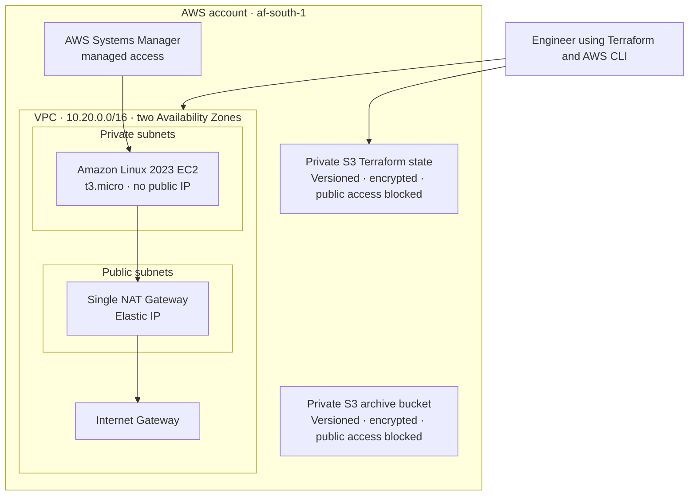

# Secure AWS Infrastructure Foundation

An AWS and Terraform project that creates a secure, repeatable foundation for a
small cloud workload: private compute, controlled outbound access, managed
administration, and protected Terraform state. It is the first project in a
three-part cloud-engineering portfolio.

[Product requirements](docs/PRD.md) · [Architecture notes](docs/architecture/overview.md) · [Validation guide](docs/validation.md) · [Deployment evidence](docs/evidence/2026-07-25-core-deployment.md) · [Production considerations](docs/production-considerations.md)

## Contents

- [Why this project](#why-this-project)
- [Architecture](#architecture)
- [What is implemented](#what-is-implemented)
- [Project boundaries](#project-boundaries)
- [Key decisions and trade-offs](#key-decisions-and-trade-offs)
- [Tools and why they were used](#tools-and-why-they-were-used)
- [Getting started](#getting-started)
- [Validation and evidence](#validation-and-evidence)
- [Production comparison](#production-comparison)
- [Engineering process](#engineering-process)
- [Cost and cleanup](#cost-and-cleanup)
- [Documentation](#documentation)
- [Roadmap](#roadmap)
- [License](#license)

## Why this project

Small teams often begin with manually configured cloud resources. That can make
networking inconsistent, widen access unnecessarily, and make a working
environment difficult to recreate. I built this project to demonstrate how a
secure AWS baseline can be defined, reviewed, and reproduced as code instead.

The outcome is a development environment with private Linux compute, no
internet-facing administration port, encrypted S3 storage, remote Terraform
state, and a network layout that is ready to support the next projects in the
portfolio.

## Architecture



The Mermaid diagram is the version-controlled architecture reference. A
polished exported diagram can be added later under
[`docs/architecture/`](docs/architecture/) for presentations or portfolio
screenshots.

## What is implemented

- A VPC (`10.20.0.0/16`) spanning `af-south-1a` and `af-south-1b`, with two
  public and two private subnets.
- An Internet Gateway, Elastic IP, public route table, and one NAT Gateway for
  controlled outbound connectivity from private workloads.
- One Amazon Linux 2023 `t3.micro` instance in a private subnet. It has no
  public IP, no SSH key pair, an encrypted root volume, and IMDSv2 required.
- An EC2 IAM role and instance profile with the standard Systems Manager policy
  for managed access without opening inbound SSH.
- A workload security group with no inbound rules and HTTPS-only outbound
  access for Systems Manager and package access.
- A private S3 archive bucket with versioning, AES-256 encryption, bucket-owner
  enforcement, and public-access blocking.
- A separate S3 remote-state bucket with the same baseline protections,
  Terraform lock files, and 90-day retention for noncurrent state versions.

## Project boundaries

| Project | Responsibility | Deliberately not included here |
| --- | --- | --- |
| Project 1: Secure AWS Infrastructure Foundation | Terraform, VPC, private compute, IAM baseline, secure storage, remote state | Monitoring rules and deployment automation |
| Project 2: Monitoring and Operational Automation | CloudWatch logs and metrics, dashboards, alarms, notifications | Redesigning the core network or workload |
| Project 3: CI/CD for Infrastructure | GitHub Actions, checks, plans, approvals, controlled applies | Foundational infrastructure or monitoring design |

## Key decisions and trade-offs

| Decision | Why it was chosen | Trade-off |
| --- | --- | --- |
| Terraform for infrastructure | Produces repeatable, reviewable infrastructure rather than manual console configuration. | Requires state management and plan review discipline. |
| Private EC2 with Systems Manager | Removes direct SSH exposure and avoids maintaining a bastion host. | Requires Systems Manager connectivity and an IAM instance role. |
| Two-AZ subnet layout | Shows availability-aware network design and provides room for future expansion. | The initial workload itself is one instance, so it is not highly available. |
| One NAT Gateway | Keeps recurring cost proportionate to a learning portfolio while allowing private workloads HTTPS egress. | Private-subnet outbound access depends on one Availability Zone. |
| S3 remote state with versioning and locking | Keeps state off an individual workstation, supports recovery, and reduces concurrent-change risk. | The state bucket must be treated as a long-lived prerequisite. |

The workload security group permits HTTPS egress to `0.0.0.0/0` as a deliberate
development-environment trade-off for Systems Manager and package repositories.
Production hardening would use VPC endpoints and narrower egress controls.

Detailed decision records are available in the [Architecture Decision Records](docs/adr/).

## Tools and why they were used

| Tool or service | Purpose in this project | Why this option |
| --- | --- | --- |
| AWS VPC, EC2, IAM, S3, Systems Manager, NAT Gateway | Provides the network, compute, identity, storage, and managed access layers. | These services support an AWS-native secure baseline without exposing the workload to the internet. |
| Terraform | Defines and composes the infrastructure modules. | It makes the environment portable, parameterised, reviewable, and reproducible. |
| AWS CLI | Verifies the active AWS identity and supports local AWS administration. | It is the standard local interface for repeatable AWS checks. |
| Git and GitHub | Tracks infrastructure changes, decisions, and validation evidence. | The repository provides an auditable portfolio record and prepares the project for CI/CD in Project 3. |
| AWS Budgets | Sends a billing alert before recurring-cost resources are used. | NAT Gateway and EC2 can incur ongoing cost; a budget guardrail makes that cost visible early. |

## Getting started

This repository documents a deployed development environment. To reproduce it
in your own AWS account, use your own globally unique S3 bucket names and do
not reuse this project's state bucket.

### Prerequisites

- An AWS account with an MFA-protected, non-root IAM identity.
- AWS CLI v2 authenticated to the intended account and region.
- Terraform `>= 1.10, < 2.0`.
- PowerShell and Git.

### Setup

```powershell
git clone https://github.com/Gerrard-Lewu/aws-01-secure-infrastructure.git
Set-Location aws-01-secure-infrastructure
aws sts get-caller-identity

Copy-Item terraform/bootstrap/terraform.tfvars.example terraform/bootstrap/terraform.tfvars
# Edit the local file with a globally unique state-bucket name for your account.
Set-Location terraform/bootstrap
terraform init
terraform plan
# Review the plan, then run: terraform apply
```

After the bootstrap apply, configure the main Terraform backend and development
variables locally:

```powershell
Set-Location ../..
Copy-Item terraform/backend.hcl.example terraform/backend.hcl
Copy-Item terraform/terraform.tfvars.example terraform/terraform.tfvars
# Edit both local files for your account, region, and globally unique archive bucket name.
Set-Location terraform
terraform init -backend-config=backend.hcl
terraform plan
# Review the plan, then run: terraform apply
```

Run the repository checks from the project root:

```powershell
.\scripts\validate.ps1
```

Never commit AWS credentials, `terraform.tfvars`, `backend.hcl`, Terraform
state, or saved plan files. For the complete first-time deployment walkthrough,
see the [manual setup guide](docs/manual-setup.md).

## Validation and evidence

Before each apply, Terraform plans are reviewed to confirm the expected
resources and controls. After deployment, the following were verified:

- The EC2 workload is private and has no public IPv4 address.
- The workload security group has no inbound rules and only HTTPS egress.
- IMDSv2 is required.
- Public routes use the Internet Gateway and private routes use the NAT Gateway.
- Systems Manager reports the Amazon Linux instance as online.
- State and archive buckets are encrypted, versioned, owner-enforced, and
  blocked from public access.
- A post-apply Terraform plan reported no changes.

The [validation guide](docs/validation.md) explains how to repeat these checks.
The [sanitised deployment evidence](docs/evidence/2026-07-25-core-deployment.md)
records the result without exposing account-specific identifiers, credentials,
or private IP addresses.

## Production comparison

This is intentionally a focused, cost-aware portfolio environment. A production
implementation would use a NAT Gateway in each Availability Zone, resilient
compute behind a load balancer where appropriate, more narrowly scoped IAM,
and VPC endpoints for private AWS service access.

It would also add centralized CloudTrail, AWS Config, GuardDuty, Security Hub,
backup policies, and organisational controls. CloudWatch observability and
notifications belong to Project 2; GitHub OIDC, automated Terraform checks,
approval gates, and controlled applies belong to Project 3. See the full
[production considerations](docs/production-considerations.md).

## Engineering process

AI-assisted tools were used to speed up research, documentation drafting, and
review checklists. I retained responsibility for the architecture, security and
cost trade-offs, AWS account actions, Terraform plan approval, deployment, and
validation. The repository's decision records and sanitised evidence show the
result of that engineering process.

## Cost and cleanup

An AWS Budget alert was configured before deploying the NAT Gateway and EC2
instance because both can create ongoing charges. The sanitised record is in
the [budget evidence](docs/evidence/2026-07-25-budget-control.md). Review the
AWS Billing console regularly while the environment is running.

Destroy application infrastructure when testing is complete, but retain the
remote-state bucket until all Terraform-managed resources are destroyed and the
state is no longer needed. Follow the [manual setup guide](docs/manual-setup.md)
for safe operational guidance.

## Documentation

- [Product requirements](docs/PRD.md)
- [Architecture overview](docs/architecture/overview.md)
- [Manual setup and deployment guide](docs/manual-setup.md)
- [Validation guide](docs/validation.md)
- [Production considerations](docs/production-considerations.md)
- [Architecture Decision Records](docs/adr/)
- [Deployment evidence](docs/evidence/)
- [Portfolio scope boundaries](docs/scope-boundaries.md)

## Roadmap

- [x] Secure Terraform state bootstrap and recovery controls.
- [x] Two-AZ VPC, private workload, Systems Manager access, and encrypted
  archive storage.
- [ ] Project 2: CloudWatch monitoring, alarms, dashboards, and notifications.
- [ ] Project 3: GitHub Actions validation, plans, approvals, and controlled
  Terraform applies.

## License

Distributed under the [MIT License](LICENSE).
